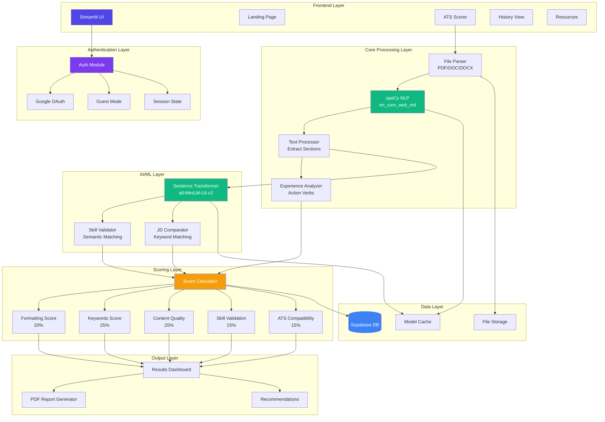
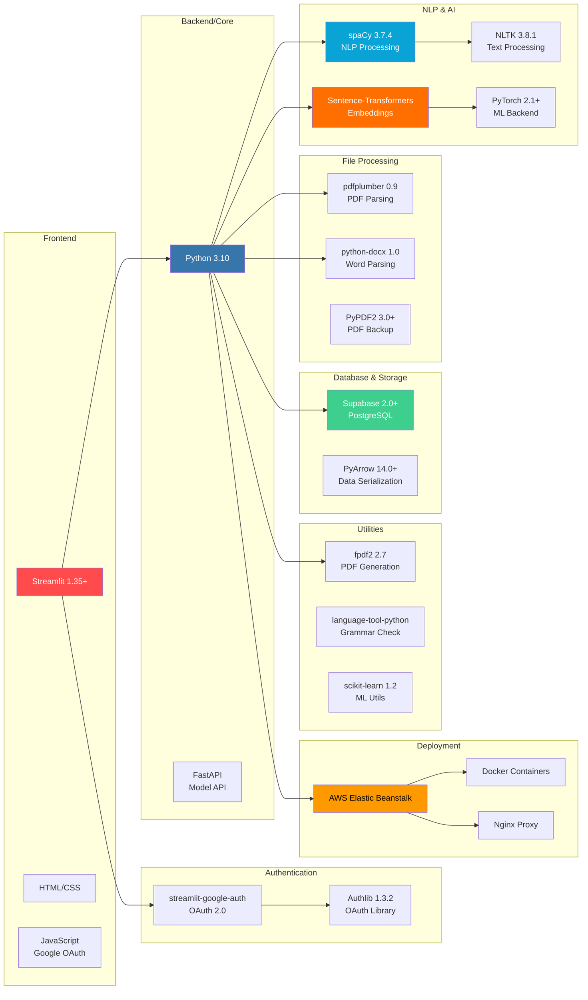

# ATS Resume Scorer - Architecture Diagrams

## 1. Model Architecture

## 2. Tech Stack

## 3. Main Workflow

```mermaid
flowchart TD
    Start([User Opens App]) --> Landing[Landing Page]
    Landing --> Auth{Authentication<br/>Required?}
    
    Auth -->|Yes| LoginChoice{Choose Login<br/>Method}
    LoginChoice -->|Google| GoogleOAuth[Google OAuth Flow]
    LoginChoice -->|Guest| GuestLogin[Guest Login]
    
    GoogleOAuth --> AuthSuccess[Set Session State]
    GuestLogin --> AuthSuccess
    
    AuthSuccess --> ScorerPage[ATS Scorer Page]
    
    ScorerPage --> ModeSelect{Select Analysis<br/>Mode}
    ModeSelect -->|General| UploadResume[Upload Resume]
    ModeSelect -->|JD Compare| UploadBoth[Upload Resume + JD]
    
    UploadResume --> ValidateFile{File Valid?}
    UploadBoth --> ValidateFile
    
    ValidateFile -->|No| Error1[Show Error]
    Error1 --> ScorerPage
    
    ValidateFile -->|Yes| ParseFile[Parse File<br/>Extract Text]
    
    ParseFile --> LoadModels[Load AI Models<br/>spaCy + Embedder]
    
    LoadModels --> ProcessText[Process Resume Text<br/>Extract Sections]
    
    ProcessText --> ExtractData[Extract Data:<br/>- Skills<br/>- Keywords<br/>- Experience<br/>- Projects]
    
    ExtractData --> ValidateSkills[Validate Skills<br/>Against Projects<br/>Semantic Matching]
    
    ValidateSkills --> AnalyzeExp[Analyze Experience<br/>Action Verbs<br/>Quantification]
    
    AnalyzeExp --> DetectLocation[Detect Location Info<br/>Privacy Check]
    
    DetectLocation --> JDProvided{Job Description<br/>Provided?}
    
    JDProvided -->|Yes| CompareJD[Compare with JD<br/>Keyword Match<br/>Semantic Similarity]
    JDProvided -->|No| SkipJD[Skip JD Comparison]
    
    CompareJD --> CalculateScore
    SkipJD --> CalculateScore[Calculate Overall Score<br/>5 Components]
    
    CalculateScore --> GenerateFeedback[Generate Feedback:<br/>- Strengths<br/>- Issues<br/>- Improvements]
    
    GenerateFeedback --> SaveDB[Save to Database<br/>Supabase]
    
    SaveDB --> DisplayResults[Display Results<br/>Dashboard]
    
    DisplayResults --> UserAction{User Action?}
    
    UserAction -->|Download PDF| GeneratePDF[Generate PDF Report]
    UserAction -->|View History| HistoryPage[History Page]
    UserAction -->|New Analysis| ScorerPage
    UserAction -->|Logout| Logout[Logout]
    
    GeneratePDF --> DisplayResults
    HistoryPage --> DisplayResults
    Logout --> Landing
    
    style Start fill:#4F46E5,color:#fff
    style AuthSuccess fill:#10B981,color:#fff
    style CalculateScore fill:#F59E0B,color:#fff
    style DisplayResults fill:#3B82F6,color:#fff
    style Error1 fill:#EF4444,color:#fff
```

## 4. Scoring Logic

```mermaid
graph TB
    subgraph "Input Data"
        Resume[Resume Text]
        Sections[Extracted Sections]
        Skills[Skills List]
        Keywords[Keywords]
        ActionVerbs[Action Verbs]
        Projects[Projects]
        JD[Job Description<br/>Optional]
    end
    
    subgraph "Component 1: Formatting - 20%"
        F1[Section Detection<br/>5 points]
        F2[Length Check<br/>3 points]
        F3[Structure Quality<br/>5 points]
        F4[Contact Info<br/>3 points]
        F5[Readability<br/>4 points]
        
        F1 --> FormatScore[Formatting Score<br/>0-20]
        F2 --> FormatScore
        F3 --> FormatScore
        F4 --> FormatScore
        F5 --> FormatScore
    end
    
    subgraph "Component 2: Keywords & Skills - 25%"
        K1[Keyword Density<br/>8 points]
        K2[Industry Keywords<br/>7 points]
        K3[Technical Skills<br/>10 points]
        
        K1 --> KeywordScore[Keywords Score<br/>0-25]
        K2 --> KeywordScore
        K3 --> KeywordScore
    end
    
    subgraph "Component 3: Content Quality - 25%"
        C1[Action Verb Usage<br/>8 points]
        C2[Quantification<br/>7 points]
        C3[Experience Depth<br/>10 points]
        
        C1 --> ContentScore[Content Score<br/>0-25]
        C2 --> ContentScore
        C3 --> ContentScore
    end
    
    subgraph "Component 4: Skill Validation - 15%"
        S1[Skills Listed<br/>5 points]
        S2[Skills Proven<br/>10 points]
        
        Embedder[Sentence Transformer<br/>Semantic Matching]
        
        S1 --> SkillScore[Skill Score<br/>0-15]
        S2 --> Embedder
        Embedder --> SkillScore
    end
    
    subgraph "Component 5: ATS Compatibility - 15%"
        A1[File Format<br/>3 points]
        A2[No Images/Tables<br/>4 points]
        A3[Standard Fonts<br/>3 points]
        A4[Keyword Placement<br/>5 points]
        
        A1 --> ATSScore[ATS Score<br/>0-15]
        A2 --> ATSScore
        A3 --> ATSScore
        A4 --> ATSScore
    end
    
    subgraph "Optional: JD Comparison Bonus"
        JDMatch[JD Keyword Match<br/>+5 bonus]
        JDSemantic[Semantic Similarity<br/>+5 bonus]
        
        JDMatch --> Bonus[Bonus Points<br/>0-10]
        JDSemantic --> Bonus
    end
    
    Resume --> F1
    Sections --> F1
    Sections --> F2
    Sections --> F3
    Sections --> F4
    Resume --> F5
    
    Keywords --> K1
    Keywords --> K2
    Skills --> K3
    
    ActionVerbs --> C1
    Resume --> C2
    Sections --> C3
    
    Skills --> S1
    Skills --> S2
    Projects --> S2
    
    Resume --> A1
    Resume --> A2
    Resume --> A3
    Keywords --> A4
    
    JD --> JDMatch
    JD --> JDSemantic
    
    FormatScore --> FinalCalc[Final Score Calculation]
    KeywordScore --> FinalCalc
    ContentScore --> FinalCalc
    SkillScore --> FinalCalc
    ATSScore --> FinalCalc
    Bonus --> FinalCalc
    
    FinalCalc --> OverallScore[Overall ATS Score<br/>0-100]
    
    OverallScore --> Rating{Score Range}
    Rating -->|90-100| Excellent[Excellent<br/>ATS Ready]
    Rating -->|75-89| Good[Good<br/>Minor Improvements]
    Rating -->|60-74| Fair[Fair<br/>Needs Work]
    Rating -->|0-59| Poor[Poor<br/>Major Issues]
    
    style FormatScore fill:#3B82F6,color:#fff
    style KeywordScore fill:#10B981,color:#fff
    style ContentScore fill:#F59E0B,color:#fff
    style SkillScore fill:#8B5CF6,color:#fff
    style ATSScore fill:#EF4444,color:#fff
    style OverallScore fill:#4F46E5,color:#fff,stroke:#000,stroke-width:3px
    style Excellent fill:#10B981,color:#fff
    style Good fill:#3B82F6,color:#fff
    style Fair fill:#F59E0B,color:#fff
    style Poor fill:#EF4444,color:#fff
```

## How to Use These Diagrams

### In Markdown/Documentation:
Copy the mermaid code blocks directly into your markdown files. GitHub, GitLab, and many documentation tools render Mermaid automatically.

### In Presentations:
1. Use [Mermaid Live Editor](https://mermaid.live/) to render and export as PNG/SVG
2. Or use tools like Obsidian, Notion, or VS Code with Mermaid plugins

### In README:
Add these diagrams to your README.md to help users understand the architecture.

## Diagram Descriptions

### 1. Model Architecture
Shows the complete system architecture with 8 layers:
- Frontend (UI components)
- Authentication (Google OAuth + Guest)
- Core Processing (File parsing, NLP)
- AI/ML (Embeddings, validation)
- Scoring (5 components)
- Data (Database, storage, cache)
- Output (Dashboard, reports)

### 2. Tech Stack
Displays all technologies organized by category:
- Frontend: Streamlit, HTML/CSS
- Backend: Python, FastAPI
- NLP/AI: spaCy, Transformers, PyTorch
- File Processing: pdfplumber, python-docx
- Database: Supabase (PostgreSQL)
- Authentication: Google OAuth
- Deployment: AWS Elastic Beanstalk

### 3. Main Workflow
Complete user journey from landing to results:
- Authentication flow (Google/Guest)
- File upload and validation
- Processing pipeline (8 stages)
- Score calculation
- Results display
- User actions (download, history, logout)

### 4. Scoring Logic
Detailed breakdown of the 5 scoring components:
- **Formatting (20%)**: Section detection, length, structure
- **Keywords (25%)**: Density, industry terms, technical skills
- **Content (25%)**: Action verbs, quantification, depth
- **Skill Validation (15%)**: Listed vs proven skills
- **ATS Compatibility (15%)**: Format, layout, fonts
- **Bonus (10%)**: JD matching (optional)

Final score ranges:
- 90-100: Excellent (ATS Ready)
- 75-89: Good (Minor improvements)
- 60-74: Fair (Needs work)
- 0-59: Poor (Major issues)
